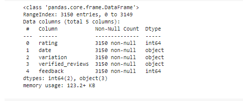
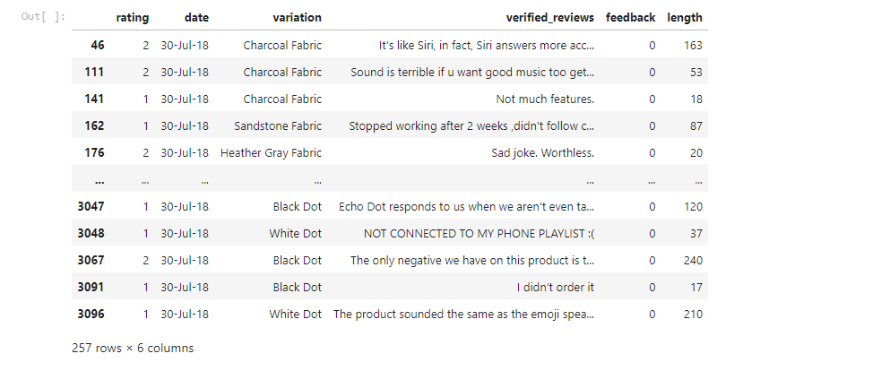
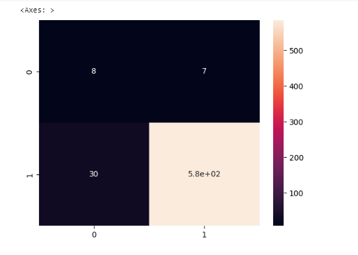

  </b> 

# NATURAL-LANGUAGE-PROCESSING-NLP-FOR-CUSTOMER-SENTIMENTS

## I) INTRODUCTION
In today's digital age, businesses are inundated with vast amounts of customer feedback across various online platforms. Understanding and interpreting this feedback is crucial for maintaining customer satisfaction and making informed business decisions. The NLP (Natural Language Processing) for Customer Sentiment Analysis project aims to leverage advanced language processing techniques to analyze and extract valuable insights from customer sentiments, reviews and predict if customers are happy or not.

In brief we develop in this project NLP Models to analyze customer reviews on social media and identify customers sentiment.

We are going to leverage TOKENIZATION (COUNT VECTORIZATION), Natural Language tool kit (nltk), NAIVE BAYES CLASSIFIER MODEL, LOGISTIC REGRESSION CLASSIFIER to performing tasks.

## II) NLP AND BUSINESS
We define Natural Language Processing (NLP) as subfield of artificial intelligence that helps computers understand, interpret and manipulate human language. NLP draws from many disciplines, including computer science and computational linguistics, in its pursuit to fill the gap between human communication and computer understanding.

Machines are very good at working with tabular data or spreadsheets. However, as human beings, we generally communicate with words and sentences, not in tabular form. Most of the information humans speak or write is unstructured. So it's not easy for computers to interpret it. In NLP (Natual Language Processing), the aim is to enable computers to understand unstructured texts and extract meaningful pieces of information from them.

## III) THE PROBLEM STATEMENT AND BUSINESS CASE
NLP can be used to build predictive models to perform sentiment analysis on social media posts and reviews and predict if customers are happy or not.

Natural language processors work by converting words into numbers and training a machine learning models to make predictions.

That way, we can automatically know if your customers are happy or not without manually going through massive number of tweets or reviews!

The public relations team of a multinational company has collected a lot of customer data, including product reviews. Based on these reviews (in text format), the team would like to know whether or not its customers are satisfied with the product. As data scientists at this multinational, we are authorized to manage this data.

data source: https://www.kaggle.com/sid321axn/amazon-alexa-reviews/kernels

We would like to thank the Kaggle team for their data.

### i) IMPORT LIBRARIES AND DATASETS

  

 

  

#### reviews_df

  

#### reviews_df.describe()

  

### ii) EXPLORE DATASET
[ ]
  1 sns.heatmap(reviews_df.isnull(), yticklabels = False, cbar = False, cmap="Reds")

  

"reviews_df.hist(bins = 30, figsize = (13,5), color = 'b')"

  

Let's get the length of the messages
reviews_df['length'] = reviews_df['verified_reviews'].apply(len)
reviews_df.head()

  

reviews_df['length'].plot(bins=100, kind='hist', color = 'coral' )

  

reviews_df.length.describe()

  

reviews_df[reviews_df['length'] == 2851]['verified_reviews'].iloc[0]

  

negative = reviews_df[reviews_df['feedback']==0]

negative

  

positive

  

sns.countplot(x = 'rating', data = reviews_df)

  

reviews_df['rating'].hist(bins = 5, color ='coral')

  

plt.figure(figsize = (40,15))
sns.barplot(x = 'variation', y='rating', data = reviews_df, palette = 'deep')

  

  

from wordcloud import WordCloud

plt.figure(figsize=(20,20))

plt.imshow(WordCloud().generate(sentences_as_one_string))

  

plt.figure(figsize=(20,20))

plt.imshow(WordCloud().generate(negative_sentences_as_one_string))

  

## IV) PERFORM DATA CLEANING
Let's drop the date

[ ]
  1
reviews_df = reviews_df.drop(['date', 'rating', 'length'], axis=1)
[ ]
  1
reviews_df
account_circle

[ ]
  1
variation_dummies = pd.get_dummies(reviews_df['variation'], drop_first = True)
We must to avoid Dummy Variable trap which occurs when one variable can be predicted from the other

[ ]
  1
variation_dummies
account_circle

First let's drop the column

[ ]
  1
reviews_df.drop(['variation'], axis=1, inplace=True)
Right now let's add the encoded column again

[ ]
  1
reviews_df = pd.concat([reviews_df, variation_dummies], axis=1)
[ ]
  1
reviews_df
account_circle

## V) REMOVE PUNCTUATION FROM TEXT
[ ]
  1
  2
import string
string.punctuation
account_circle

[ ]
  1
Test = 'Hello Mr. Future, I am so happy to be learning AI now!!'
[ ]
  1
  2
Test_punc_removed = [char for char in Test if char not in string.punctuation]
Test_punc_removed
account_circle
['H',
 'e',
 'l',
 'l',
 'o',
 ' ',
 'M',
 'r',
 ' ',
 'F',
 'u',
 't',
 'u',
 'r',
 'e',
 ' ',
 'I',
 ' ',
 'a',
 'm',
 ' ',
 's',
 'o',
 ' ',
 'h',
 'a',
 'p',
 'p',
 'y',
 ' ',
 't',
 'o',
 ' ',
 'b',
 'e',
 ' ',
 'l',
 'e',
 'a',
 'r',
 'n',
 'i',
 'n',
 'g',
 ' ',
 'A',
 'I',
 ' ',
 'n',
 'o',
 'w']
We join the characters again to form the string.

Test_punc_removed_join = ''.join(Test_punc_removed)
Test_punc_removed_join
account_circle

## VI) REMOVE STOPWORDS

import nltk # Natural Language tool kit
nltk.download('stopwords')
account_circle
[nltk_data] Downloading package stopwords to /root/nltk_data...
[nltk_data]   Package stopwords is already up-to-date!
True
You have to download stopwords Package to execute this command

from nltk.corpus import stopwords
stopwords.words('english')

['i',
 'me',
 'my',
 'myself',
 'we',
 'our',
 'ours',
 'ourselves',
 'you',
 "you're",
 "you've",
 "you'll",
 "you'd",
 'your',
 'yours',
 'yourself',
 'yourselves',
 'he',
 'him',
 'his',
 'himself',
 'she',
 "she's",
 'her',
 'hers',
 'herself',
 'it',
 "it's",
 'its',
 'itself',
 'they',
 'them',
 'their',
 'theirs',
 'themselves',
 'what',
 'which',
 'who',
 'whom',
 'this',
 'that',
 "that'll",
 'these',
 'those',
 'am',
 'is',
 'are',
 'was',
 'were',
 'be',
 'been',
 'being',
 'have',
 'has',
 'had',
 'having',
 'do',
 'does',
 'did',
 'doing',
 'a',
 'an',
 'the',
 'and',
 'but',
 'if',
 'or',
 'because',
 'as',
 'until',
 'while',
 'of',
 'at',
 'by',
 'for',
 'with',
 'about',
 'against',
 'between',
 'into',
 'through',
 'during',
 'before',
 'after',
 'above',
 'below',
 'to',
 'from',
 'up',
 'down',
 'in',
 'out',
 'on',
 'off',
 'over',
 'under',
 'again',
 'further',
 'then',
 'once',
 'here',
 'there',
 'when',
 'where',
 'why',
 'how',
 'all',
 'any',
 'both',
 'each',
 'few',
 'more',
 'most',
 'other',
 'some',
 'such',
 'no',
 'nor',
 'not',
 'only',
 'own',
 'same',
 'so',
 'than',
 'too',
 'very',
 's',
 't',
 'can',
 'will',
 'just',
 'don',
 "don't",
 'should',
 "should've",
 'now',
 'd',
 'll',
 'm',
 'o',
 're',
 've',
 'y',
 'ain',
 'aren',
 "aren't",
 'couldn',
 "couldn't",
 'didn',
 "didn't",
 'doesn',
 "doesn't",
 'hadn',
 "hadn't",
 'hasn',
 "hasn't",
 'haven',
 "haven't",
 'isn',
 "isn't",
 'ma',
 'mightn',
 "mightn't",
 'mustn',
 "mustn't",
 'needn',
 "needn't",
 'shan',
 "shan't",
 'shouldn',
 "shouldn't",
 'wasn',
 "wasn't",
 'weren',
 "weren't",
 'won',
 "won't",
 'wouldn',
 "wouldn't"]

Test_punc_removed_join

Test_punc_removed_join_clean = [word for word in Test_punc_removed_join.split() if word.lower() not in stopwords.words('english')]

Test_punc_removed_join_clean # Only important (no so common) words are left

['Hello', 'Mr', 'Future', 'happy', 'learning', 'AI']

mini_challenge = 'Here is a mini challenge, that will teach you how to remove stopwords and punctuations!'

challege = [ char     for char in mini_challenge  if char not in string.punctuation ]
challenge = ''.join(challege)
challenge = [  word for word in challenge.split() if word.lower() not in stopwords.words('english')  ]
## VII) PERFORM COUNT VECTORIZATION (TOKENIZATION)

from sklearn.feature_extraction.text import CountVectorizer
sample_data = ['This is the first document.','This document is the second document.','And this is the third one.','Is this the first document?']

vectorizer = CountVectorizer()
X = vectorizer.fit_transform(sample_data)

print(vectorizer.get_feature_names_out())

['and' 'document' 'first' 'is' 'one' 'second' 'the' 'third' 'this']

print(X.toarray())
account_circle
[[0 1 1 1 0 0 1 0 1]
 [0 2 0 1 0 1 1 0 1]
 [1 0 0 1 1 0 1 1 1]
 [0 1 1 1 0 0 1 0 1]]

mini_challenge = ['Hello World','Hello Hello World','Hello World world world']

vectorizer_challenge = CountVectorizer()
X_challenge = vectorizer_challenge.fit_transform(mini_challenge)
print(X_challenge.toarray())

[[1 1]
 [2 1]
 [1 3]]
## VIII) PERFORM DATA CLEANING
Let's define a pipeline to clean up all the messages. The pipeline performs the following: (1) remove punctuation, (2) remove stopwords

def message_cleaning(message):
    Test_punc_removed = [char for char in message if char not in string.punctuation]
    Test_punc_removed_join = ''.join(Test_punc_removed)
    Test_punc_removed_join_clean = [word for word in Test_punc_removed_join.split() if word.lower() not in stopwords.words('english')]
    return Test_punc_removed_join_clean
Right now we are going to test the newly added function

reviews_df_clean = reviews_df['verified_reviews'].apply(message_cleaning)

print(reviews_df_clean[3]) # show the cleaned up version

['lot', 'fun', 'thing', '4', 'yr', 'old', 'learns', 'dinosaurs', 'control', 'lights', 'play', 'games', 'like', 'categories', 'nice', 'sound', 'playing', 'music', 'well']

print(reviews_df['verified_reviews'][3]) # show the original version

I have had a lot of fun with this thing. My 4 yr old learns about dinosaurs, i control the lights and play games like categories. Has nice sound when playing music as well.

reviews_df_clean

0                                            [Love, Echo]
1                                                 [Loved]
2       [Sometimes, playing, game, answer, question, c...
3       [lot, fun, thing, 4, yr, old, learns, dinosaur...
4                                                 [Music]
                              ...                        
3145                    [Perfect, kids, adults, everyone]
3146    [Listening, music, searching, locations, check...
3147    [love, things, running, entire, home, TV, ligh...
3148    [complaint, sound, quality, isnt, great, mostl...
3149                                               [Good]
Name: verified_reviews, Length: 3150, dtype: object

from sklearn.feature_extraction.text import CountVectorizer
### Define the cleaning pipeline we defined earlier

vectorizer = CountVectorizer(analyzer = message_cleaning)

reviews_countvectorizer = vectorizer.fit_transform(reviews_df['verified_reviews'])

print(vectorizer.get_feature_names_out())

['072318' '1' '10' ... '😬' '😳' '🤓']

print(reviews_countvectorizer.toarray())
account_circle
[[0 0 0 ... 0 0 0]
 [0 0 0 ... 0 0 0]
 [0 0 0 ... 0 0 0]
 ...
 [0 0 0 ... 0 0 0]
 [0 0 0 ... 0 0 0]
 [0 0 0 ... 0 0 0]]

reviews_countvectorizer.shape

(3150, 5211)

reviews_df

let's drop the column

reviews_df.drop(['verified_reviews'], axis=1, inplace=True)
reviews = pd.DataFrame(reviews_countvectorizer.toarray())

#$$ Now let's concatenate them together
reviews_df = pd.concat([reviews_df, reviews], axis=1)

reviews_df

We are foing to drop the target label coloumns

X = reviews_df.drop(['feedback'],axis=1)

X
account_circle

[ ]
  1
y = reviews_df['feedback']

y

0       1
1       1
2       1
3       1
4       1
       ..
3145    1
3146    1
3147    1
3148    1
3149    1
Name: feedback, Length: 3150, dtype: int64
## IX) TRAIN A NAIVE BAYES CLASSIFIER MODEL

X.shape

(3150, 5226)

y.shape

(3150,)

X_train=X_train.astype(str)

from sklearn.model_selection import train_test_split

X_train, X_test, y_train, y_test = train_test_split(X, y, test_size = 0.2) #, random_state=5)

from sklearn.naive_bayes import MultinomialNB

NB_classifier = MultinomialNB()
NB_classifier.fit(X_train,y_train)

X_train.shape

(2520, 5226)

X_test.shape

(630, 5226)

y_train.shape

(2520,)

y_test.shape

(630,)

ANN_classifier = tf.keras.models.Sequential()
ANN_classifier.add(tf.keras.layers.Dense(units=400, activation='relu', input_shape=(4059, )))
ANN_classifier.add(tf.keras.layers.Dense(units=400, activation='relu'))
ANN_classifier.add(tf.keras.layers.Dense(units=1, activation='sigmoid'))

ANN_classifier.summary()

Model: "sequential_2"
_________________________________________________________________
 Layer (type)                Output Shape              Param   
=================================================================
 dense_6 (Dense)             (None, 400)               1624000   
                                                                 
 dense_7 (Dense)             (None, 400)               160400    
                                                                 
 dense_8 (Dense)             (None, 1)                 401       
                                                                 
=================================================================

Total params: 1784801 (6.81 MB)

Trainable params: 1784801 (6.81 MB)

Non-trainable params: 0 (0.00 Byte)
_________________________________________________________________

from sklearn.model_selection import train_test_split
X_train, X_test, y_train, y_test = train_test_split(X, y, test_size=0.2, random_state=101)

### keeping 80% as training data and 20% as testing data.

X.columns = X.columns.astype(str)
NB_classifier = MultinomialNB()
NB_classifier.fit(X_train, y_train)

## X) ASSESS TRAINED MODEL PERFORMANCE
from sklearn.metrics import classification_report, confusion_matrix

y_predict_train = NB_classifier.predict(X_train)
y_predict_train
cm = confusion_matrix(y_train, y_predict_train)
sns.heatmap(cm, annot=True)

  

### Predicting the Test set results
y_predict_test = NB_classifier.predict(X_test)
cm = confusion_matrix(y_test, y_predict_test)
sns.heatmap(cm, annot=True)

  

print(classification_report(y_test, y_predict_test))

              precision    recall  f1-score   support

           0       0.42      0.39      0.41        38
           1       0.96      0.96      0.96       592

    accuracy                           0.93       630
   macro avg       0.69      0.68      0.68       630
weighted avg       0.93      0.93      0.93       630

## XI) ASSIGNMENT - TRAIN AND EVALUATE A LOGISTIC REGRESSION CLASSIFIER

from sklearn.linear_model import LogisticRegression
from sklearn.metrics import accuracy_score

model = LogisticRegression()
model.fit(X_train, y_train)

[ ]
  1
y_pred = model.predict(X_test)

### Testing Set Performance
y_pred

array([1, 1, 1, 1, 1, 1, 1, 1, 1, 0, 1, 1, 1, 1, 1, 1, 1, 1, 1, 1, 1, 1,
       1, 1, 1, 1, 1, 1, 1, 1, 1, 1, 1, 1, 1, 1, 1, 1, 1, 1, 1, 1, 1, 1,
       1, 1, 1, 1, 1, 1, 1, 1, 1, 1, 1, 1, 1, 1, 1, 1, 1, 1, 1, 1, 1, 1,
       1, 1, 1, 1, 1, 1, 1, 1, 1, 0, 1, 1, 1, 1, 1, 1, 1, 1, 1, 1, 1, 1,
       1, 1, 1, 1, 1, 1, 1, 1, 1, 1, 1, 1, 1, 1, 1, 1, 1, 1, 1, 1, 1, 1,
       1, 1, 0, 1, 1, 1, 1, 1, 1, 1, 1, 1, 1, 1, 1, 1, 1, 1, 1, 1, 1, 1,
       1, 1, 1, 1, 1, 1, 1, 1, 1, 1, 1, 1, 1, 1, 1, 1, 1, 1, 1, 1, 1, 0,
       1, 1, 1, 1, 1, 1, 1, 1, 1, 1, 1, 1, 1, 1, 1, 1, 1, 1, 0, 1, 1, 1,
       1, 1, 1, 1, 1, 1, 1, 1, 1, 1, 1, 1, 1, 1, 1, 1, 1, 1, 1, 1, 1, 1,
       1, 1, 1, 1, 1, 1, 1, 1, 1, 1, 0, 1, 1, 1, 1, 1, 1, 1, 1, 1, 1, 1,
       1, 1, 1, 1, 1, 1, 1, 1, 1, 1, 1, 1, 1, 1, 1, 1, 1, 1, 1, 1, 1, 1,
       1, 1, 1, 1, 1, 1, 1, 1, 1, 1, 1, 1, 1, 1, 1, 1, 1, 1, 1, 1, 0, 0,
       1, 1, 1, 1, 1, 1, 1, 1, 1, 1, 1, 1, 1, 1, 1, 1, 1, 1, 1, 1, 1, 1,
       1, 1, 1, 1, 1, 1, 1, 1, 1, 1, 1, 1, 1, 1, 1, 1, 1, 1, 1, 1, 1, 1,
       1, 1, 1, 1, 1, 1, 1, 1, 1, 1, 1, 1, 0, 1, 1, 1, 1, 1, 1, 1, 1, 1,
       1, 1, 1, 1, 1, 1, 1, 1, 1, 1, 0, 1, 1, 1, 1, 1, 1, 1, 1, 1, 1, 1,
       1, 1, 1, 1, 1, 1, 1, 1, 1, 1, 1, 1, 1, 1, 1, 1, 1, 1, 1, 1, 0, 1,
       1, 1, 1, 1, 1, 1, 1, 1, 1, 1, 1, 1, 1, 1, 1, 1, 1, 1, 1, 1, 1, 1,
       1, 1, 1, 1, 0, 1, 1, 0, 1, 1, 1, 1, 1, 1, 1, 1, 1, 1, 1, 1, 1, 1,
       1, 1, 1, 1, 1, 1, 1, 1, 1, 1, 1, 1, 1, 1, 0, 1, 1, 1, 1, 1, 1, 1,
       1, 1, 1, 1, 1, 1, 1, 1, 1, 1, 1, 1, 1, 1, 1, 1, 1, 1, 1, 1, 1, 1,
       1, 1, 1, 1, 1, 1, 1, 1, 1, 1, 1, 1, 1, 1, 1, 1, 1, 1, 1, 1, 1, 1,
       1, 1, 1, 1, 1, 1, 1, 1, 1, 1, 1, 1, 1, 1, 0, 1, 1, 1, 1, 1, 1, 1,
       1, 1, 1, 1, 1, 1, 1, 1, 1, 1, 1, 1, 1, 1, 1, 1, 1, 1, 1, 1, 1, 1,
       1, 1, 1, 1, 1, 1, 1, 1, 1, 1, 1, 1, 1, 1, 1, 1, 1, 1, 1, 1, 1, 1,
       1, 1, 1, 1, 1, 1, 1, 1, 1, 1, 1, 1, 1, 1, 1, 1, 1, 1, 1, 1, 1, 1,
       1, 1, 1, 1, 1, 1, 1, 1, 1, 1, 1, 1, 1, 1, 1, 1, 1, 1, 1, 1, 1, 1,
       1, 1, 1, 1, 1, 1, 1, 1, 1, 1, 1, 1, 1, 1, 1, 1, 1, 1, 1, 1, 1, 1,
       1, 1, 1, 1, 1, 1, 1, 1, 1, 1, 1, 1, 1, 1])

from sklearn.metrics import confusion_matrix, classification_report

print('Accuracy {} %'.format( 100 * accuracy_score(y_pred, y_test)))

Accuracy 94.12698412698413 %

cm = confusion_matrix(y_pred, y_test)
sns.heatmap(cm, annot = True)

  

print(classification_report(y_test, y_pred))

              precision    recall  f1-score   support

           0       0.53      0.21      0.30        38
           1       0.95      0.99      0.97       592

    accuracy                           0.94       630
   macro avg       0.74      0.60      0.64       630
weighted avg       0.93      0.94      0.93       630

Author
Lebede Ngartera

Other Contributors
Kaggle Team for providing data.
